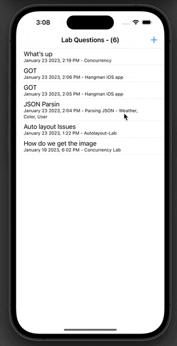

# LabQuestions
App that focuses on the POST http method as well as the GET method. The purpose of the app is to have users create questions that are topic specific that can be answered by other users. 

## Core Features
- JSON decoding and encoding 
- Working with a mock REST Api
- Data persistence to save questions 
- MVC Architecture 
- URLSession 

### Gif

